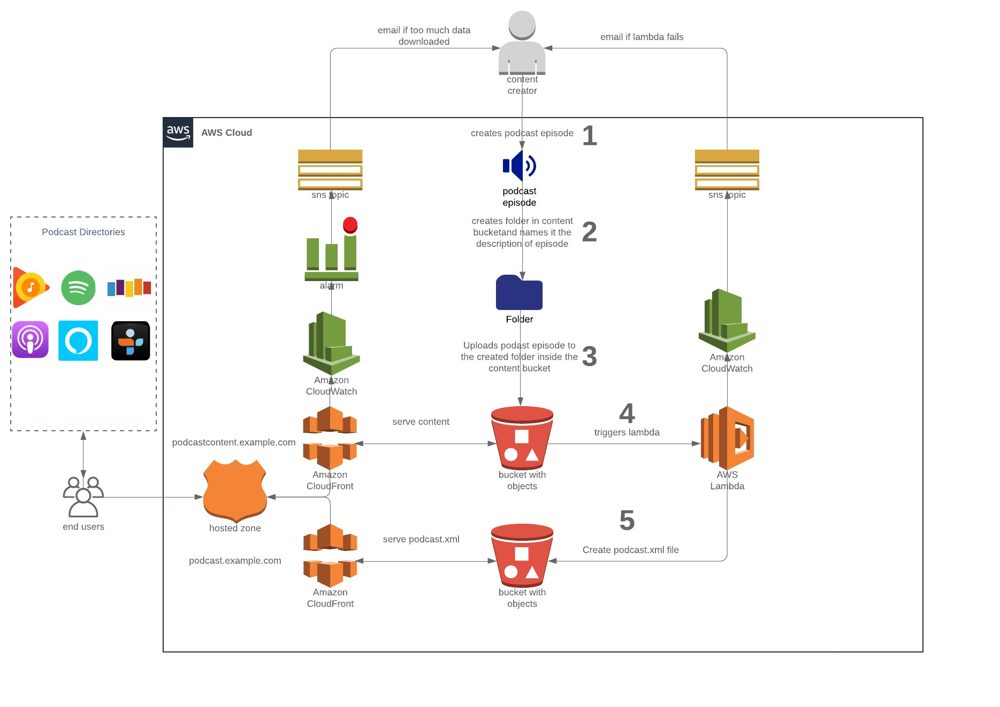

# terraform-podcast
terraform script for provisioning infrastructure to host your own podcast

# Setup

1) You need a domain name registered

    export TF_VAR_domain_name=example.com
    
    export TF_VAR_content_domain_name=podcastcontent.example.com
    
    export TF_VAR_rss_domain_name=podcast.example.com
    
    export TF_VAR_rss_bucket_name=podcast-rss-bucket-name-example
    
    export TF_VAR_content_bucket_name=podcast-content-bucket-name-example
    
    terraform apply

# Using Infrastructure
1) Record/Edit your podcast episode
2) From inside aws -> s3 -> your content bucket
2) Inside the content bucket upload a file named image.jpeg = the podcast image (3000x3000px)
3) Create folder in content bucket - name it anything, just no spaces
4) Inside that same folder upload an mp3 for the episode - name it anything, just no spaces
5) Inside that same folder upload an image named image.jpeg = the episode image (3000x3000px with 72dpi)
6) Inside that same folder upload 
 - a file named title.txt = containing the name of the episode
 - a file named description.txt = containing the episode description
 - a file named pubdate.txt = containing the date the episode was published in RFC822 date format
 - a file named duration.txt = the duration of the episode in seconds
 - a file named explicit.txt = true, false
 
alternate - using aws cli
From inside a folder with a single folder for each podcast episode
    
  Download contents of s3 content bucket to the directory you are in

    aws s3 sync s3://bucketname .

  sync the contents of the directory you are in with the s3 content bucket

    aws s3 sync . s3://bucketname
    
example of Organizing objects(folders) for each podcast episode:

episode1/episode1.mp3
episode1/image.jpeg
episode1/title.txt
episode1/description.txt
episode1/pubdate.txt
episode1/explicit.txt

episode2/episode2.mp3
episode2/image.jpeg
episode2/title.txt
episode2/description.txt
episode2/pubdate.txt
episode2/explicit.txt

# Run Tests
    cd tests; go test -timeout 45m | tee test_output.log

To definitely do:
1) ensure no public access to bucket (cloudfront to bucket only)
2) lambda cloudwatch alarm is not able to publish to the sns topic
3) create cloudfront alarm for bytes downloaded in the content bucket
4) create a new sns topic for that cloudfront alarm
5) generate a subscriber when script is executed
6) create module for everything
7) more logging
8) tests: rss feed test, xml validation, content/rss buckets can't be reached publicly
9) cloudwatch dashboard with metrics on cloudfront downloads

improvement ideas: dynamo db store creation/upload times, trigger transcription of audio

Useful links to podcast xml guidelines
[google podcasat rss guidelines](https://developers.google.com/search/docs/guides/podcast-guidelines)
[apple podcast connect](https://help.apple.com/itc/podcasts_connect/#/itcc0e1eaa94)
